CountdownLabel
========================


[](https://github.com/Carthage/Carthage)
[](http://cocoadocs.org/docsets/CountdownLabel)

Simple countdown UILabel with morphing animation, and some useful function.

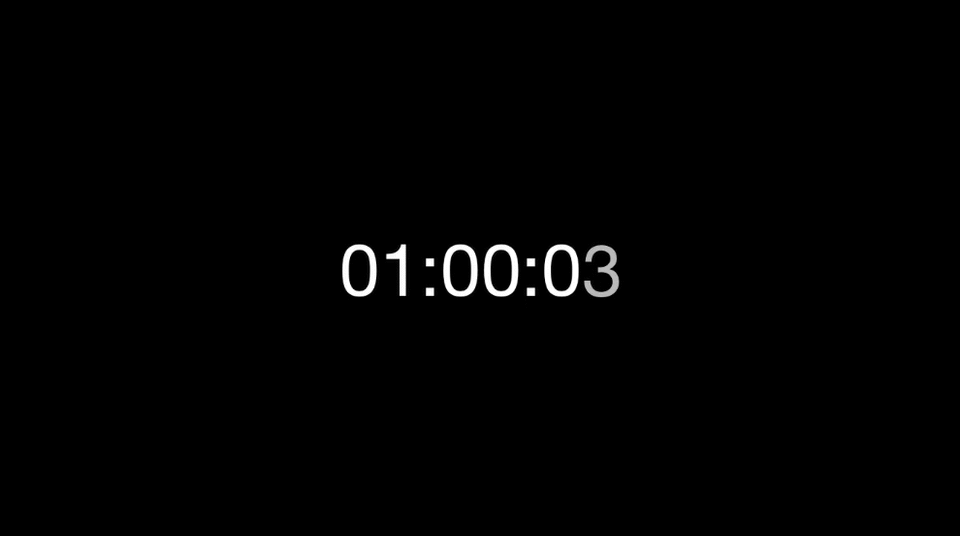

## features
- Simple creation
- Easily get status of countdown from property and delegate.
- Insert some of function, and completion
- Style change as usual as UILabel do
- Morphing animation from [LTMorphingLabel](https://github.com/lexrus/LTMorphingLabel).
- XCTest assertion

### Version vs Swift version.

Below is a table that shows which version of what you should use for your Swift version.

| Swift version | version    |
| ------------- | --------------- |
| 4.2           | >= 4.0 |
| 4.0, 4.1      | >= 3.0 |
| 3.X           | >= 2.0 |
| 2.3           | 1.3  |

## Usage
You need only 2 lines. 

```swift
// from current Date, after 30 minutes.
let countdownLabel = CountdownLabel(frame: frame, minutes: 30) // you can use NSDate as well
countdownLabel.start()
```

#### Morphing example
Use `animationType`.
Those effect comes from [LTMorphingLabel](https://github.com/lexrus/LTMorphingLabel).

```swift
let countdownLabel = CountdownLabel(frame: CGRectZero, time: 60*60)
countdownLabel.animationType = .Pixelate
countdownLabel.start()
```

| morphing effect | example | 
| -------- |--------- | 
| .Burn |  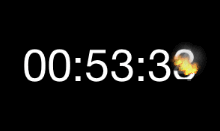 |
| .Evaporate |  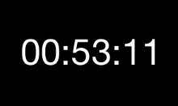 |
| .Fall |  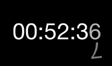 |
| .Pixelate |  |   
| .Scale | 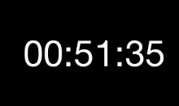 |   
| .Sparkle | 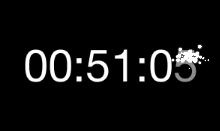 |

#### Style
you can directly allocate it as a UILabel property just like usual.

```swift
countdownLabel.textColor = .orangeColor()
countdownLabel.font = UIFont(name:"Courier", size:UIFont.labelFontSize())
countdownLabel.start()
```

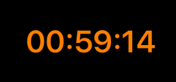 

#### Get Status of timer
there's some property for reading status.
```swift
countdownLabel.timeCounted      // timer that has been counted
countdownLabel.timeRemaining    // timer's remaining

// example
@IBAction func getTimerCounted(sender: UIButton) {
    debugPrint("\(countdownLabel.timeCounted)")
}

@IBAction func getTimerRemain(sender: UIButton) {
    debugPrint("\(countdownLabel.timeRemaining)")
}
```

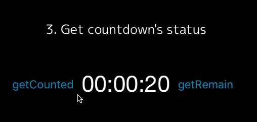 

#### Control countdown
You can pause, start, change time.

```swift
// check if pause or not
if countdownLabel.isPaused {
    // timer start
    countdownLabel.start()
} else {
    // timer pause
    countdownLabel.pause()
}
```

```swift
// -2 minutes for ending
@IBAction func minus(btn: UIButton) {
    countdownLabel.addTime(-2)
}
    
// +2 minutes for ending
@IBAction func plus(btn: UIButton) {
    countdownLabel.addTime(2)
}
```

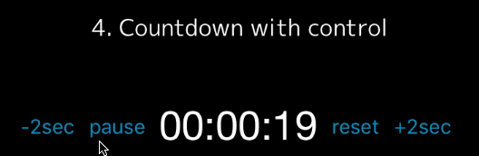 

#### Insert Function
Using `then` function or `delegate`, you can set your function anywhere you like.

```swift
// then property 
countdownLabel.then(10) { [unowned self] in
    self.countdownLabel.animationType = .Pixelate
    self.countdownLabel.textColor = .greenColor()
}
countdownLabel.then(5) { [unowned self] in
    self.countdownLabel.animationType = .Sparkle
    self.countdownLabel.textColor = .yellowColor()
}
countdownLabel.start() {
    self.countdownLabel.textColor = .whiteColor()
}

// delegate
func countingAt(timeCounted timeCounted: NSTimeInterval, timeRemaining: NSTimeInterval) {
    switch timeRemaining {
    case 10:
        self.countdownLabel6.animationType = .Pixelate
        self.countdownLabel6.textColor = .greenColor()
    case 5:
        self.countdownLabel6.animationType = .Sparkle
        self.countdownLabel6.textColor = .yellowColor()
    default:
        break
    }
}
func countdownFinished() {
    self.countdownLabel.textColor = .whiteColor()
}

```

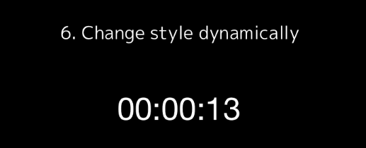 

#### Attributed Text
you can set as attributedText too. note:but morphing animation will be disabled.
```swift
countdownLabel.setCountDownTime(30)
countdownLabel.timeFormat = "ss"
countdownLabel.countdownAttributedText = CountdownAttributedText(text: "timer HERE in text", replacement: "HERE")
countdownLabel.start() 
```

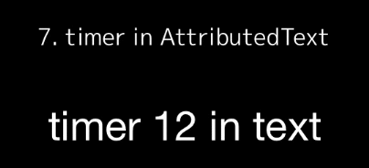 


#### Format
Don't specified over 24 hours or you'll get wrong format.
CountdownLabel uses `00:00:00 (HH:mm:ss)` as default format.
if you prefer using another format, Your can set your time format like below.


`countdownLabel.timeFormat = @"mm:ss"`


#### Scheduled
you can set scheduled timer

```swift
// after 10 minutes will start a countdown from 20.
let fromDate   = NSDate().dateByAddingTimeInterval(10)
let targetDate = fromDate.dateByAddingTimeInterval(20)
let countdownLabel = CountdownLabel(frame: CGRectZero, fromDate: fromDate, targetDate: targetDate)
countdownLabel.start()
```

#### Check Status 
some public properties are useful. 

```swift
countdownLabel.isCounting      // check timer is counting now
countdownLabel.isPaused        // check timer was stopped
countdownLabel.isFinished      // check timer has ended
countdownLabel.morphingEnabled // check morphing is enabled
```

## Requirements
- iOS 9.0+
- Swift 2.3+
- ARC

##Installation

####CocoaPods
available on CocoaPods. Just add the following to your project Podfile:
```
pod 'CountdownLabel'
use_frameworks!
```

####Carthage
To integrate into your Xcode project using Carthage, specify it in your Cartfile:

```ogdl
github "suzuki-0000/CountdownLabel"
```

## Inspirations
* [LTMorphingLabel](https://github.com/lexrus/LTMorphingLabel) is motivation for creating this.
* In many reference from [MZTimerLabel](https://github.com/mineschan/MZTimerLabel).  

## License
available under the MIT license. See the LICENSE file for more info.


